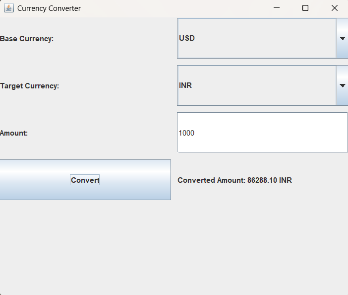

# 🪙 Java Currency Converter (GUI + Console)

A modern, beginner-friendly Java project that performs currency conversion using real-time exchange rates from the [ExchangeRate-API](https://www.exchangerate-api.com/).  
This project includes:

- ✅ A **Swing-based GUI** version  
- ✅ A **Console-based CLI** version

Perfect for those looking to learn Java with APIs, desktop GUI, and network programming concepts!

---

## 📸 GUI Preview



---

## 🚀 Features

- 🌍 Live exchange rate integration via API
- 🖥️ Swing GUI with dropdowns and validation
- 💻 Console-based interaction for basic terminals
- 🔁 Converts between popular currencies (USD, INR, EUR, GBP, JPY, etc.)
- 🛡️ Input validation & error handling for API/network failures
- 🪟 Cross-platform (Windows/macOS/Linux)

---

## 📁 Project Structure

```
CurrencyConverter/
│
├── CurrencyConverterGUI.java         # GUI Version
├── CurrencyConverterConsole.java     # Console Version
├── lib/
│   ├── okhttp-3.14.9.jar
│   ├── okio-1.17.5.jar
│   └── json-20240303.jar
└── README.md
```

---

## 🧱 Requirements

- Java 8 or later
- Internet connection
- External `.jar` libraries:

| Library     | Version   | Download Link |
|-------------|-----------|----------------|
| OkHttp      | 3.14.9    | [Download](https://repo1.maven.org/maven2/com/squareup/okhttp3/okhttp/3.14.9/okhttp-3.14.9.jar) |
| Okio        | 1.17.5    | [Download](https://repo1.maven.org/maven2/com/squareup/okio/okio/1.17.5/okio-1.17.5.jar) |
| org.json    | 20240303  | [Download](https://repo1.maven.org/maven2/org/json/json/20240303/json-20240303.jar) |

---

## ⚙️ Setup Instructions

### 1. Clone the Repository

```bash
git clone https://github.com/your-username/CurrencyConverter.git
cd CurrencyConverter
```

### 2. Add Required Libraries

Place all downloaded `.jar` files into the `lib/` folder.

---

## 🖥️ Run the Console Version

### Compile

#### On Windows:
```bash
javac -cp ".;lib/*" CurrencyConverterConsole.java
```

#### On Linux/macOS:
```bash
javac -cp ".:lib/*" CurrencyConverterConsole.java
```

### Run

#### On Windows:
```bash
java -cp ".;lib/*" CurrencyConverterConsole
```

#### On Linux/macOS:
```bash
java -cp ".:lib/*" CurrencyConverterConsole
```

---

## 🪟 Run the GUI Version

### Compile

#### On Windows:
```bash
javac -cp ".;lib/*" CurrencyConverterGUI.java
```

#### On Linux/macOS:
```bash
javac -cp ".:lib/*" CurrencyConverterGUI.java
```

### Run

#### On Windows:
```bash
java -cp ".;lib/*" CurrencyConverterGUI
```

#### On Linux/macOS:
```bash
java -cp ".:lib/*" CurrencyConverterGUI
```

---

## 🔑 API Key Setup

1. Visit [ExchangeRate-API](https://www.exchangerate-api.com/)
2. Sign up and obtain your free API key
3. In both Java files, replace:

```java
String apiKey = "YOUR_API_KEY";
```

with your actual key.

---

## 📊 Example (Console)

**Input:**
```
Base Currency: USD
Target Currency: INR
Amount: 100
```

**Output:**
```
Converted Amount: 8335.10 INR
```

---

## 🧠 Learning Highlights

- Working with external APIs using OkHttp
- Parsing JSON data in Java
- Creating graphical interfaces with Swing
- Writing console-based interactive programs
- API key security practices

---

## 📌 License

Apache License 2.0 — free to use, modify, and distribute with attribution.

---

## ✨ Author

**Satwik Saxena**  
📎 [LinkedIn](https://www.linkedin.com/in/satwik-12-dev)